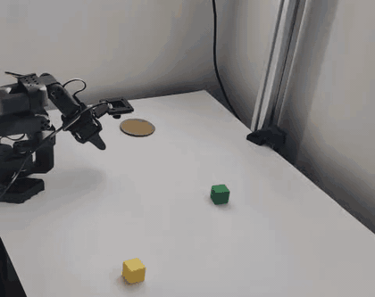

  

<h1 align="center">Brandon Jahoor</h1>

  <b>Robotics · Perception · Autonomy</b> 
  Mechatronics Engineering @ University of Waterloo

  <i>I'm the guy who makes robots actually do things.</i>

 

  
  &nbsp;
  

  Projects · Experience · Resume — all live over there

 

  

  
  
  
  
  

 

<table align="center">
<tr>
<td align="center" width="33%">
  <h3>🦿</h3>
  <b>Embodied AI</b> 
  VLA policies, RL in Isaac Lab, sim-to-real transfer
</td>
<td align="center" width="33%">
  <h3>👁️</h3>
  <b>Perception</b> 
  Depth streams, open-vocab detection, real-time pipelines
</td>
<td align="center" width="33%">
  <h3>🧭</h3>
  <b>Autonomy</b> 
  ROS2 nav stacks, LiDAR cost maps, path planning
</td>
</tr>
</table>
